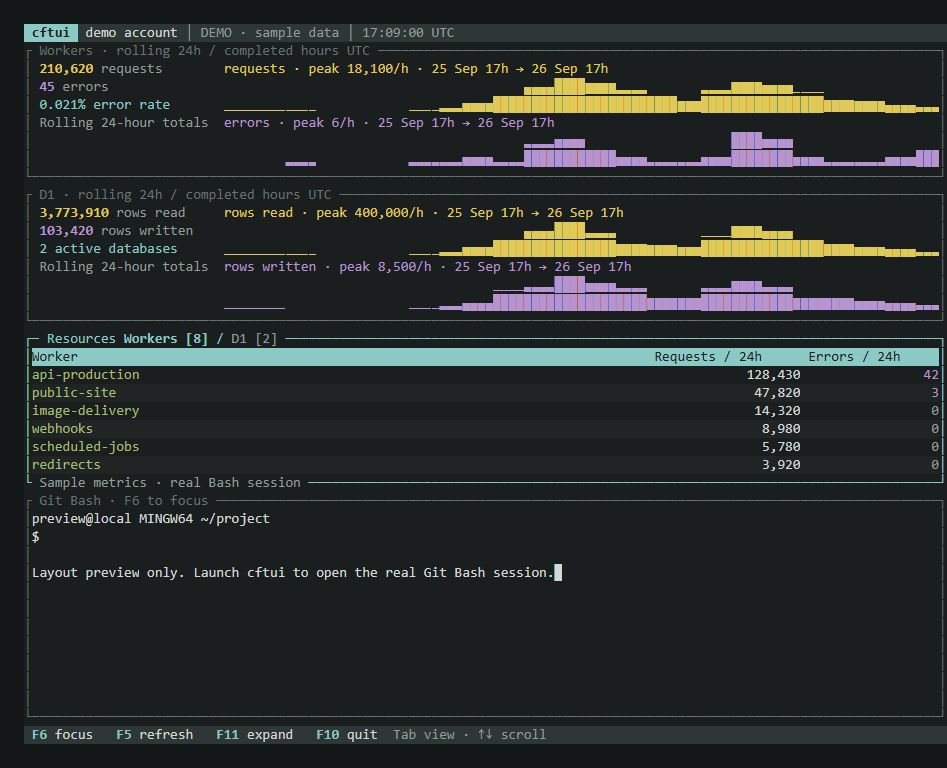

# cftui

I made this so I could have worker stats, git bash and wrangler in the same window. Use it, or don't, whatever.



- Worker requests and errors over the last 24 hours, with graphs and a searchable list.
- D1 rows read and written over the last 24 hours.
- Live Worker logs through Wrangler. Search them, show errors only, pause them or open an event's JSON.
- A proper Git Bash terminal. Run Wrangler, change folders, do your usual stuff.
- Project, Git branch, dirty state, ahead/behind counts, environment, account and CLI versions at the top.
- Last deployment for the selected Worker, including when it went out and which versions are serving traffic.
- An HTTP GET inspector for status codes, headers, response bodies and timings. Redirects stay put so you can see the Location header.
- Panels you can hide, expand and bring back. Your layout and last project are saved when you quit.
- Separate Bash sessions for saved projects. Switching back keeps the session where you left it.
- Sleeps when there's nothing to redraw. Logs stay in memory, with a 32 MiB limit across live and paused views.
- Windows for now. macOS hasn't been tested.
- [MIT licence](LICENSE).

- **Run it:** grab the Windows ZIP from [Releases](https://github.com/gordonspence/cftui/releases), extract it and run `cftui.exe`. No Rust or Cargo needed.
- **You'll need:** [Git for Windows](https://git-scm.com/download/win) and a terminal such as Windows Terminal. Install Node.js and Wrangler if you want Wrangler commands and live logs. Project-local Wrangler works too, through `npx --no-install wrangler`.
- **Try the demo:** double-click `demo.cmd`, or run this from Git Bash. The stats and logs are samples; the shell and HTTP requests work as usual.

  ```bash
  ./cftui.exe --demo
  ```

- **Connect Cloudflare:** copy `cftui.example.toml` to `cftui.toml`. Set `account_id` to your account ID and `project_dir` to the folder you want Bash to start in.
- **Set the token:** create one in [Cloudflare's API token settings](https://dash.cloudflare.com/profile/api-tokens) with **Account Analytics → Read**, scoped to your account. Add **Workers Scripts → Read** for deployment details. Then launch it from Git Bash:

  ```bash
  export CFTUI_API_TOKEN='your-token'
  ./cftui.exe
  ```

- **Wrangler login:** use your existing Wrangler login or `CLOUDFLARE_API_TOKEN`. The dashboard token is separate.
- **Pick a different folder or config:** use `--project` or `--config`. `CFTUI_ACCOUNT_ID` also works instead of the account ID in the config. `.env` files aren't loaded automatically.

  ```bash
  ./cftui.exe --demo --project 'C:/path/to/your/project'
  ./cftui.exe --config 'C:/path/to/cftui.toml'
  ```

- **Panels:** click to focus. `[+]` expands, `[-]` restores, `[x]` hides. F1–F4 toggle Workers, D1, Resources and Bash. F6 moves focus, F8 hides, F9 brings everything back, F11 expands/restores.
- **Workers and D1:** Tab switches the resource list. Arrows select, `/` searches, `s` changes sorting, Enter opens Worker details. F5 refreshes.
- **Logs:** select a Worker and press `L`. `e` shows errors only, Space pauses/resumes, `f` follows, `x` stops the tail. Enter opens an event; arrows scroll it. Esc goes back to the list. Live logs show new invocations, not old ones.
- **HTTP inspector:** press `c` with the dashboard focused. `u` edits the URL, Ctrl+U clears it, Enter or `r` sends the GET. Tab switches headers/body, arrows and PageUp/PageDown scroll, Esc closes it. Response bodies are capped at 256 KiB; log details at 32 KiB. Longer content is marked as truncated.
- **Shell:** focus Bash and type normally. Ctrl+C interrupts a command. Shift+PageUp/PageDown scrolls. Hiding Bash keeps it running; quitting closes the sessions.
- **Projects:** add entries like this to `cftui.toml`, then press F7 to switch. The folder set in `project_dir` is always available as Default.

  ```toml
  [[projects]]
  name = "My app"
  path = 'C:\path\to\your\app'
  environment = "production"
  ```

- **Environments:** the project environment appears in the header and is available in Bash as `$CFTUI_PROJECT_ENV`. Add `--env` to Wrangler commands yourself, for example `wrangler dev --env "$CFTUI_PROJECT_ENV"`.
- **Layouts:** `1` gives you the overview, `2` debugging, `3` the shell. `[` and `]` resize Bash. F12 saves the layout straight away. These shortcuts work with the dashboard focused.
- **Help and exit:** `?` shows the keys. F10 quits from anywhere; `q` quits with the dashboard focused.
- **Refresh:** metrics update every 60 seconds by default. Change `refresh_seconds` in the config; the minimum is 15. Git status updates every five seconds without fetching, so ahead/behind counts use your locally known upstream. Deployment details update every minute.
- **Stats:** Cloudflare analytics can be sampled or delayed. Graphs show completed UTC hours; totals cover a rolling 24 hours. Missing data shows as unavailable. Deployment status tells you what's serving, not whether the Worker is healthy.
- **Build it yourself:** install Rust and Windows MSVC Build Tools or MinGW. From PowerShell in the repo, `./run.ps1 --demo` runs it and `./build.ps1` creates the EXE, ZIP and checksum in `dist/release`. From Git Bash, `cargo run -- --demo` works with Rust and a linker on PATH.
- **Check the code:** `cargo fmt --check`, `cargo test --locked`, `cargo clippy --all-targets --locked -- -D warnings`.
- **Other handy bits:** `--check` prints analytics as JSON, `--check-shell` checks the Git Bash terminal, `--preview preview.html` exports a sample layout, `--help` lists the options.
- Just messing around.
